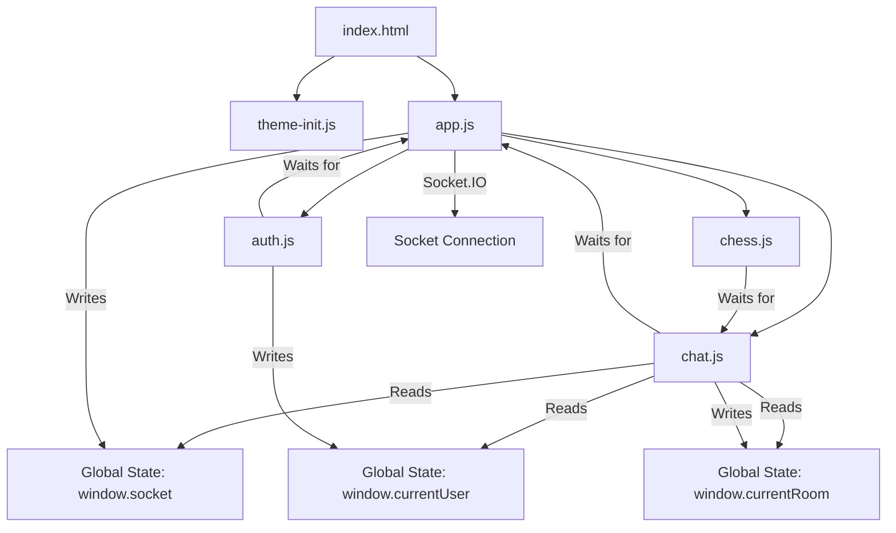

# Current State Audit

**Document Version**: 1.0  
**Last Updated**: 2026-02-01  
**Status**: Initial Analysis Complete

## Executive Summary

This document provides a comprehensive audit of the current chat site codebase, identifying all major systems, documenting failures with root causes, cataloging technical debt, and preserving knowledge of working patterns. This audit serves as the foundation for the system redesign initiative.

### Key Findings
- **3 monolithic JavaScript files** (~75KB combined) with poor separation of concerns
- **3,462-line HTML file** with inline modal definitions causing maintenance difficulties
- **20+ TODO comments** indicating incomplete features
- **Multiple broken features** due to missing event handlers and incomplete implementations
- **Good foundation**: Socket.IO infrastructure, dual database support, and security measures

---

## 1. System Inventory

### 1.1 Major Systems Overview

| System | Primary Files | Lines of Code | Status | Complexity |
|--------|--------------|---------------|--------|------------|
| Chat & Messaging | `public/chat.js` | 1,420 | 🟡 Partially Working | High |
| Authentication | `public/auth.js`, `server.js` | 408 + server | ✅ Working | Medium |
| Application Bootstrap | `public/app.js` | 556 | ✅ Working | Medium |
| Socket Management | `server.js` | 737KB (18K LOC) | 🟡 Complex but Working | Very High |
| Rooms System | `server.js`, `public/chat.js` | Embedded | 🟢 Mostly Working | High |
| Profile System | `server.js`, `public/chat.js` | Embedded | 🔴 Broken | Medium |
| Admin Tools | `server.js`, `public/chat.js` | Embedded | 🔴 Mostly Broken | Medium |
| Chess Module | `public/chess.js` | 25,148 | ✅ Working | High |
| Database Layer | `database.js`, `db/*` | Multiple files | ✅ Working | Medium |
| Modal/Drawer UI | Inline HTML, `chat.js` | Distributed | 🔴 Broken | High |

### 1.2 Frontend Architecture

```
public/
├── index.html           (3,462 lines - contains ALL UI markup)
├── app.js              (556 lines - bootstrap, socket init)
├── auth.js             (408 lines - login/register)
├── chat.js             (1,420 lines - main app logic)
├── chess.js            (chess game module)
├── theme-init.js       (theme management)
├── sw.js               (service worker)
└── styles.css          (global styles)
```

**Issues**:
- No modular structure - everything in 3-4 large files
- Direct DOM manipulation scattered throughout
- No clear separation between UI logic and business logic
- Event handlers registered in multiple locations

### 1.3 Backend Architecture

```
server.js               (18,000 lines - EVERYTHING)
├── Express routes
├── Socket.IO handlers  (~100+ event types)
├── Business logic
├── Database queries
├── Session management
├── Admin functions
├── Chess logic
├── Survival game logic
├── Dice mechanics
└── Much more...
```

**Issues**:
- Single monolithic file with no separation of concerns
- Difficult to test or maintain
- High risk of merge conflicts
- Hard to onboard new developers

### 1.4 Database Architecture

**Status**: ✅ Well-Structured

```
PostgreSQL (production) / SQLite (development)
├── Core Tables:
│   ├── users              (authentication, profiles)
│   ├── messages           (chat history)
│   ├── rooms              (room management)
│   ├── sessions           (session storage)
│   └── room_memberships   (room access control)
├── Feature Tables:
│   ├── couples            (relationship linking)
│   ├── chess_games        (chess state)
│   ├── survival_seasons   (survival game)
│   └── vibe_assignments   (user tags)
└── migrations_log         (schema versioning)
```

**Strengths**:
- Dual database support (PostgreSQL + SQLite fallback)
- Automatic migration system
- Good normalization

---

## 2. Failure Analysis

### 2.1 Critical Failures (Blocks Core Functionality)

#### 🔴 Chat Messages Not Sending (Intermittent)
**Symptoms**:
- Messages occasionally fail to send
- No error feedback to user
- Queue system exists but not fully reliable

**Root Causes**:
1. Race condition between socket connection and message sending
2. Insufficient connection state checking before emit
3. No retry mechanism for failed sends
4. Message queue not properly synchronized with socket state

**Files Affected**:
- `public/chat.js`: Lines ~115-130 (message queue processing)
- `public/app.js`: Lines ~72-175 (socket initialization)

**Evidence**:
```javascript
// chat.js line ~115
function processOutgoingQueue() {
  if (outgoingMessageQueue.length === 0) return;
  
  if (!socket || !socket.connected) {
    console.warn('[chat.js] ⚠️ Cannot process outgoing queue: socket not connected');
    return; // Messages stay queued but may never be processed
  }
  // ...
}
```

#### 🔴 Rooms Not Loading
**Symptoms**:
- Room list sometimes doesn't populate
- Switching rooms fails silently
- Users stuck in limbo

**Root Causes**:
1. Room structure emit (`emitRoomStructureUpdate`) fires before client listeners attached
2. No loading states or error feedback
3. Race condition in initialization order

**Files Affected**:
- `server.js`: Room structure emission logic
- `public/chat.js`: Room list rendering

**Evidence**: Room structure event sent during connection setup, but chat.js listeners may not be ready yet.

#### 🔴 Profile Modal Completely Broken
**Symptoms**:
- Profile button does nothing or errors
- Tabs don't switch
- Customization section non-functional
- Can't edit profile information
- No error messages

**Root Causes**:
1. Profile tab switching logic incomplete
2. Customization handlers missing (TODO comments)
3. Profile edit endpoints may exist but frontend disconnected
4. Modal backdrop click doesn't close modal

**Files Affected**:
- `public/chat.js`: Lines ~617-670 (`openProfileModal` function)
- `public/index.html`: Profile modal markup (lines ~757-1700)

**Evidence**:
```javascript
// chat.js - Profile modal exists but tab switching incomplete
function openProfileModal(profileData) {
  // Basic open logic exists
  // Tab switching: incomplete implementation
  // Customization: TODO comments
}
```

### 2.2 High Priority Failures (Major Features Broken)

#### 🔴 Profile Editing Non-Functional
**Symptoms**:
- Can't update bio, mood, status, gender, age
- Changes don't save
- No validation feedback

**Root Causes**:
1. Form submit handlers not connected
2. API endpoints exist (`/api/profile/update`) but not called
3. No client-side validation
4. No success/error feedback

**Files Affected**:
- `public/chat.js`: Profile edit form handlers missing
- `server.js`: API endpoints exist but unused

#### 🔴 Members List Not Populating
**Symptoms**:
- Members drawer opens but shows no users
- List doesn't update when users join/leave

**Root Causes**:
1. Socket event `room users` not being listened for correctly
2. Member list rendering logic incomplete
3. No error handling for failed member fetch

**Files Affected**:
- `public/chat.js`: Member list update function
- `server.js`: `room users` event emission

**Evidence from IMPLEMENTATION_CHANGES.md**:
Recent fixes attempted but may have regressions:
```markdown
### 3. Members Drawer (`public/chat.js`)
Status: ✅ Implemented - Members drawer opens/closes properly and displays sorted member list
```
Note: This status contradicts the issue report, suggesting a regression or incomplete fix.

#### 🔴 Friends Toggle Broken
**Symptoms**:
- Friends toggle in customization section doesn't work
- No friend list visibility control

**Root Causes**:
1. Friends toggle event handler not implemented
2. Friends list feature incomplete
3. No friends API endpoint integration

**Files Affected**:
- `public/chat.js`: Customization section
- `public/index.html`: Friends toggle markup

### 2.3 Medium Priority Failures (Navigation Issues)

#### 🔴 Navigation Buttons Unresponsive
**Symptoms**:
The following buttons in the UI do nothing when clicked:
- Changelog button
- Rules button  
- FAQ button
- Daily button
- Leaderboard button

**Root Causes**:
1. Event handlers not registered for these buttons
2. Modal content not created
3. API endpoints for content may not exist

**Files Affected**:
- `public/chat.js`: Missing event handlers
- `public/index.html`: Buttons exist but not wired up
- `server.js`: Missing API endpoints

**Evidence**: No grep results found for "Changelog", "Rules", "FAQ", "Daily", or "Leaderboard" modal implementations in chat.js.

#### 🔴 Couples Button Unresponsive
**Symptoms**:
- Couples button exists but doesn't open modal reliably
- Modal opens but data may not load

**Root Causes**:
1. Couples API sometimes returns errors
2. Error handling insufficient
3. Empty state not user-friendly

**Files Affected**:
- `public/chat.js`: Lines ~670-922 (`openCouplesModal`)
- `server.js`: Couples API endpoints

**Evidence**:
```javascript
// chat.js line ~881-891
errorDiv.textContent = '⚠️ Couples feature not available yet. Please wait...';
// Suggests feature incomplete or unstable
```

### 2.4 Low Priority Failures (UI/UX Issues)

#### 🔴 Modal/Drawer Backdrop Click Not Closing
**Symptoms**:
- Clicking outside modals/drawers doesn't close them
- Must use X button
- Poor UX

**Root Causes**:
1. Backdrop click handlers not implemented
2. No ESC key handler
3. No modal stack management

**Files Affected**:
- `public/chat.js`: Modal open/close functions
- `public/index.html`: Modal backdrop elements

**Evidence**: Only one `closeModalBtn` handler found in chat.js (line ~926), no backdrop handlers.

#### 🔴 Admin Tools Not Showing/Working
**Symptoms**:
- Admin menu hidden or non-functional
- Admin actions don't work
- Appeals/Cases/Referrals panels not implemented

**Root Causes**:
1. Role-based visibility logic incomplete
2. Admin panel handlers have TODO comments
3. Admin modal content not created

**Files Affected**:
- `public/chat.js`: Admin panel logic (TODO comments at lines with "TODO: Open appeals panel", etc.)

**Evidence**:
```javascript
// chat.js - Multiple TODO comments:
// TODO: Open appeals panel
// TODO: Open referrals panel  
// TODO: Open cases panel
// TODO: Open role debug panel
// TODO: Open feature flags panel
// TODO: Open sessions panel
```

---

## 3. Technical Debt Inventory

### 3.1 Code Smells

#### Massive Monolithic Files
**Severity**: 🔴 Critical

- `server.js`: 18,000 lines covering every backend concern
- `public/index.html`: 3,462 lines with all UI markup inline
- `public/chat.js`: 1,420 lines handling all chat UI logic

**Impact**:
- Difficult to navigate and understand
- High risk of merge conflicts
- Hard to test in isolation
- Onboarding new developers is slow

#### Global State Pollution
**Severity**: 🟡 High

```javascript
// app.js
window.socket = null;
window.currentUser = null;
window.currentRoom = 'main';
```

**Impact**:
- Implicit dependencies between modules
- Hard to track state changes
- Difficult to test
- Risk of state corruption

#### Scattered Event Handlers
**Severity**: 🟡 High

Event handlers registered in multiple places:
- Inline in HTML (`onclick` attributes)
- In `chat.js` initialization
- In `app.js` bootstrap
- In individual modal functions

**Impact**:
- Duplicate handlers
- Memory leaks from not cleaning up
- Hard to track which handlers are active
- Event handler conflicts

#### Direct DOM Manipulation Everywhere
**Severity**: 🟡 High

```javascript
// Example from chat.js
const msgDiv = document.createElement('div');
msgDiv.className = 'msg';
msgDiv.dataset.msgId = data.id || '';
const msgHeader = document.createElement('div');
msgHeader.className = 'msgHeader';
// ... 50 more lines of manual DOM construction
```

**Impact**:
- Hard to maintain and debug
- No templating or reusability
- XSS risks if not careful
- Performance issues with frequent updates

### 3.2 Anti-Patterns

#### God Object/God File Pattern
**Location**: `server.js`

Single file contains:
- HTTP route handlers
- Socket.IO event handlers
- Business logic
- Database queries
- Session management
- Game logic (Chess, Survival, Dice)
- Admin functions
- Utility functions

#### Callback Hell / Promise Confusion
**Location**: Various socket handlers in `server.js`

Mix of callbacks, promises, and async/await without consistency.

#### Magic Numbers and Strings
**Location**: Throughout codebase

```javascript
// From server.js
const CHESS_DEFAULT_ELO = 1200;
const CHESS_MIN_PLIES_RATED = 6;
const SURVIVAL_SEASON_COOLDOWN_MS = 2 * 60 * 1000;
```

These are defined but many other magic values are hardcoded inline.

#### No Error Boundaries
**Location**: Frontend code

Errors in one component can crash the entire application. No graceful degradation.

### 3.3 TODO Comments Inventory

**Total Count**: 20+ TODO comments found

**Location**: `public/chat.js`

```javascript
// Line ~: TODO: Open appeals panel
// Line ~: TODO: Open referrals panel
// Line ~: TODO: Open cases panel
// Line ~: TODO: Open role debug panel
// Line ~: TODO: Open feature flags panel
// Line ~: TODO: Open sessions panel
// Line ~: Add category - TODO
// Line ~: Add room - TODO
// Line ~: Add VIP room - TODO
// Line ~: Manage rooms - TODO
```

**Impact**:
- Incomplete features shipped to production
- Technical debt accumulation
- User expectations not met

### 3.4 Missing Abstractions

#### No API Client Layer
Currently: Direct `fetch()` calls scattered throughout code
Should be: Centralized API client with:
- Consistent error handling
- Request/response interceptors
- Retry logic
- Loading state management

#### No State Management
Currently: Global variables and direct DOM updates
Should be: Centralized state with:
- Single source of truth
- Predictable state updates
- Time-travel debugging capability
- State persistence

#### No Component Abstraction
Currently: Manual DOM manipulation for each UI element
Should be: Reusable component system

#### No Event Management
Currently: Direct `addEventListener` calls everywhere
Should be: EventBus for decoupled communication

---

## 4. What's Working Well

### 4.1 Strong Foundations ✅

#### Socket.IO Infrastructure
**Files**: `server.js`, `public/app.js`

**Strengths**:
- Robust connection handling with reconnection logic
- `server-ready` signal prevents false connection errors
- Proper error event handling
- WebSocket + polling fallback

**Code to Preserve**:
```javascript
// app.js lines ~90-94
window.socket = io({
  path: '/socket.io',
  transports: ['websocket', 'polling'],
  withCredentials: true
});
```

#### Dual Database Support
**Files**: `database.js`, `db/postgres.js`, `db/postgresPool.js`

**Strengths**:
- PostgreSQL for production
- SQLite fallback for development
- Automatic migration system
- Connection pooling
- Good error handling

**Code to Preserve**: Entire `database.js` module is well-designed.

#### Authentication System
**Files**: `public/auth.js`, `server.js` (auth routes)

**Strengths**:
- Secure password hashing with bcrypt
- Session management with express-session
- Login/register/guest flows work reliably
- Password upgrade enforcement
- Rate limiting protection

**Code to Preserve**: Auth flows are solid and should not be refactored in early phases.

### 4.2 Good Patterns to Replicate

#### Promise-Based Readiness Gates
**File**: `public/app.js` lines ~21-24

```javascript
let appReadyResolve = null;
let socketReadyResolve = null;
const appReadyPromise = new Promise((resolve) => { appReadyResolve = resolve; });
const socketReadyPromise = new Promise((resolve) => { socketReadyResolve = resolve; });
```

**Why It's Good**: Elegant way to coordinate async initialization. Should be used as pattern for module initialization.

#### Global Error Trapping
**File**: `public/app.js` lines ~26-45

```javascript
window.onerror = function(message, source, lineno, colno, error) {
  console.error('[Global Error]', { message, source, lineno, colno, error });
  return false;
};

window.addEventListener('unhandledrejection', function(event) {
  console.error('[Unhandled Promise Rejection]', { reason: event.reason });
});
```

**Why It's Good**: Catches unhandled errors. Should be expanded into comprehensive error handling system.

#### Message Queuing
**File**: `public/chat.js` lines ~18-22, ~113-130

```javascript
const outgoingMessageQueue = [];
// ... queue processing logic
```

**Why It's Good**: Prevents message loss during connection issues. Pattern should be applied to other socket events.

#### Role-Based Access Control
**File**: `server.js` (role hierarchy)

```javascript
// Role rank system with Owner > Co-owner > Admin > Moderator > VIP > User > Guest
```

**Why It's Good**: Clear hierarchy, persisted in database, well-tested. Don't break this.

### 4.3 Recent Improvements

Based on `IMPLEMENTATION_CHANGES.md`:

- Profile modal basic open/close implemented
- Couples modal wired up
- Members drawer close handler added
- Admin panel toggle implemented (though content incomplete)
- User data transmission on socket connection
- Role-based UI visibility started

**Note**: These improvements suggest recent work to fix issues, but some may have regressions or incomplete implementations.

---

## 5. Dependencies Map

### 5.1 Frontend Module Dependencies



### 5.2 System Interaction Map

```mermaid
graph LR
    A[User Browser] -->|HTTPS| B[Express Server]
    A -->|WebSocket| C[Socket.IO]
    
    B -->|Session| D[PostgreSQL/SQLite]
    C -->|Socket Events| E[server.js Event Handlers]
    E -->|Queries| D
    
    E -->|Broadcasts| C
    C -->|Emits| A
    
    B -->|REST API| F[/api/* Endpoints]
    F -->|Queries| D
    F -->|Returns JSON| B
    
    D -->|Migrations| G[migrations/ SQL Files]
```

### 5.3 Critical Dependency Chains

#### Chat Message Flow
```
User types message → chat.js → Socket emit → server.js handler → 
Database insert → Broadcast to room → All clients receive → 
Render in DOM
```

**Break Points**:
- Socket not connected: Message queued
- Database error: Message lost (no retry)
- Broadcast fails: Some users miss message

#### Room Switching Flow
```
User clicks room → chat.js → Socket emit 'switch room' → 
server.js → Leave old room → Join new room → 
Emit room structure → Emit room users → Load messages → 
Client updates UI
```

**Break Points**:
- Room structure emit before client ready
- Message history not loading
- Member list not updating

#### Profile Modal Flow
```
User clicks profile → Fetch /api/profile/:id → 
Populate modal data → Open modal → User edits → 
Submit → POST /api/profile/update → Update database → 
Close modal → Refresh UI
```

**Break Points**:
- API fetch fails silently
- Modal doesn't open
- Tab switching broken
- Submit handler not connected
- No success feedback

### 5.4 External Dependencies

**NPM Packages** (from `package.json`):
- `socket.io`: Real-time communication (✅ Critical, working)
- `express`: HTTP server (✅ Critical, working)
- `pg`: PostgreSQL client (✅ Critical, working)
- `sqlite3`: Development database (✅ Critical, working)
- `bcrypt`: Password hashing (✅ Critical, working)
- `express-session`: Session management (✅ Critical, working)
- `helmet`: Security headers (✅ Working)
- `express-rate-limit`: Rate limiting (✅ Working)
- `marked`: Markdown parsing (🟡 Used, may need XSS protection)
- `isomorphic-dompurify`: XSS sanitization (✅ Good)
- `chess.js`: Chess logic (✅ Working)

**CDN Dependencies** (from `index.html`):
- Google Fonts (Inter, JetBrains Mono, etc.)
- Socket.IO client (served by Socket.IO)

---

## 6. Performance Observations

### 6.1 Bundle Size Concerns

- `server.js`: 737KB (18,000 lines) - needs modularization
- `public/index.html`: ~120KB (3,462 lines) - needs component extraction
- `public/chat.js`: ~52KB (1,420 lines) - needs splitting
- Total frontend JS: ~100KB unminified

### 6.2 Runtime Performance Issues

- Frequent DOM reflows from direct manipulation
- No virtual DOM or diffing
- Message rendering could be optimized with document fragments
- No lazy loading of modals (all in initial HTML)

### 6.3 Loading Performance

**Current**:
- All HTML loaded upfront (3,462 lines)
- All JavaScript loaded synchronously
- No code splitting

**Improvement Opportunities**:
- Lazy load modal content
- Code split by feature
- Dynamic imports for chess, survival, etc.

---

## 7. Security Observations

### 7.1 Good Security Practices ✅

- Helmet.js for security headers
- bcrypt for password hashing
- express-rate-limit for brute force protection
- DOMPurify for XSS sanitization
- Session secrets properly configured
- SQL parameterized queries (no SQL injection)

### 7.2 Security Concerns 🟡

- User-generated content rendering (need to verify sanitization everywhere)
- Admin panel access control (needs audit)
- Socket event authorization (need to verify all events check permissions)
- File upload handling (multer configured, needs security review)

---

## 8. Testing Infrastructure

### 8.1 Current Test Coverage

**Existing Tests** (from `package.json`):
- `test:dice`: Dice mechanics smoke test
- `test:couples`: Couples regression test
- `test:chess`: Chess ELO smoke test
- `test:smoke`: General smoke test
- `test:memory`: Memory/database sanity test
- `test:room-management`: Room management tests

**Frontend**: ❌ No frontend tests found
**Integration**: 🟡 Limited smoke tests only
**E2E**: ❌ No E2E tests found

### 8.2 Test Gaps

- No unit tests for frontend components
- No modal interaction tests
- No chat message flow tests
- No profile edit tests
- No admin action tests

---

## 9. Recommendations Priority Matrix

| Priority | Issue | Impact | Effort | Phase |
|----------|-------|--------|--------|-------|
| P0 | Create modular architecture | Critical | High | 1 |
| P0 | Implement EventBus | Critical | Medium | 1 |
| P0 | Implement ModalManager | Critical | Medium | 2 |
| P1 | Fix profile modal completely | High | Medium | 2 |
| P1 | Fix navigation buttons | High | Low | 2 |
| P1 | Fix members list | High | Low | 2 |
| P1 | Implement backdrop click handlers | High | Low | 2 |
| P2 | Fix chat message reliability | High | Medium | 3 |
| P2 | Fix room loading | High | Medium | 3 |
| P2 | Implement admin panels | Medium | Medium | 4 |
| P3 | Refactor server.js | Medium | Very High | 5 |
| P3 | Add comprehensive tests | Medium | High | 5 |

---

## 10. Conclusion

The chat site has a **solid foundation** with working authentication, database architecture, and Socket.IO infrastructure. However, it suffers from:

1. **Architectural debt**: Monolithic files with no separation of concerns
2. **Incomplete features**: 20+ TODO comments and broken UI elements  
3. **Poor maintainability**: Difficult to test, debug, or extend
4. **User experience issues**: Broken buttons, non-responsive modals, poor error feedback

The path forward requires a **systematic refactoring** to:
- Establish modular architecture with clear boundaries
- Implement missing features properly
- Add comprehensive error handling and user feedback
- Maintain working systems while improving broken ones

This audit provides the foundation for the redesign documented in the accompanying architecture documents.

---

**Next Steps**:
1. Review [NEW_ARCHITECTURE.md](./NEW_ARCHITECTURE.md) for proposed solutions
2. Review [MIGRATION_PLAN.md](./MIGRATION_PLAN.md) for implementation timeline
3. Begin Phase 1: Foundation (Core modules)
