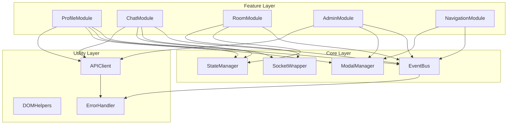
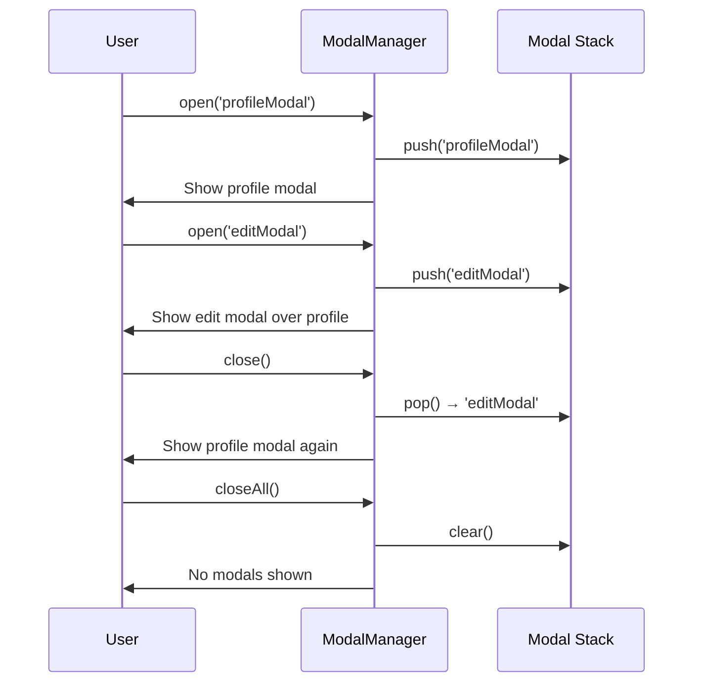
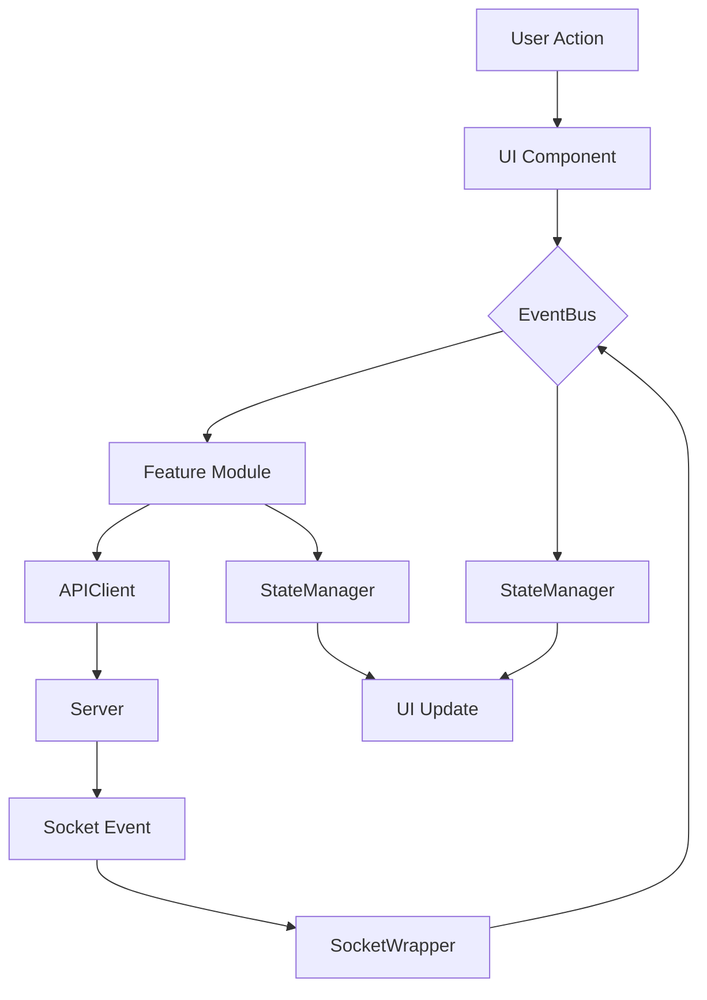
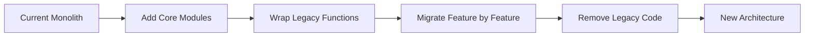

# New Architecture Design

**Document Version**: 1.0  
**Last Updated**: 2026-02-01  
**Status**: Proposed Architecture

## Executive Summary

This document outlines the proposed event-driven modular architecture for the chat site redesign. The new architecture addresses critical failures identified in the current state audit while preserving working systems. The design emphasizes **modularity**, **testability**, **maintainability**, and **reliability**.

### Core Principles

1. **Event-Driven Communication**: Loose coupling through EventBus
2. **Modular Structure**: Clear separation of concerns
3. **Single Responsibility**: Each module has one well-defined purpose
4. **Fail-Safe Defaults**: Graceful degradation and error recovery
5. **Progressive Enhancement**: Features work independently

---

## 1. Architecture Pattern

### 1.1 Event-Driven Modular Architecture



### 1.2 Why Event-Driven?

**Benefits**:
- **Loose Coupling**: Modules don't need to know about each other
- **Extensibility**: New features subscribe to existing events
- **Testability**: Mock EventBus for isolated testing
- **Debugging**: Centralized event logging
- **Maintainability**: Clear data flow paths

**Example Flow**:
```javascript
// Old way (tight coupling):
function sendMessage(text) {
  socket.emit('chat message', text);
  updateMessageCount();
  updateUserStats();
  checkAchievements();
}

// New way (event-driven):
function sendMessage(text) {
  EventBus.emit('message:send', { text });
  // Other modules subscribe to 'message:send' and handle their logic
}
```

---

## 2. Module Structure

### 2.1 Proposed Folder Organization

```
public/
├── modules/
│   ├── core/
│   │   ├── event-bus.js           // Central pub/sub system
│   │   ├── state-manager.js       // Application state management
│   │   ├── modal-manager.js       // Unified modal/drawer system
│   │   └── socket-wrapper.js      // Reliable socket abstraction
│   │
│   ├── features/
│   │   ├── profile/
│   │   │   ├── profile-modal.js   // Profile UI and interactions
│   │   │   ├── profile-api.js     // Profile API calls
│   │   │   └── profile-state.js   // Profile-specific state
│   │   │
│   │   ├── chat/
│   │   │   ├── message-handler.js // Message send/receive logic
│   │   │   ├── message-renderer.js// Message DOM rendering
│   │   │   ├── room-manager.js    // Room switching logic
│   │   │   └── chat-state.js      // Chat-specific state
│   │   │
│   │   ├── admin/
│   │   │   ├── admin-panel.js     // Admin UI
│   │   │   ├── admin-actions.js   // Admin action handlers
│   │   │   └── admin-api.js       // Admin API calls
│   │   │
│   │   ├── members/
│   │   │   ├── members-list.js    // Members drawer UI
│   │   │   └── members-state.js   // Members list state
│   │   │
│   │   ├── rooms/
│   │   │   ├── room-list.js       // Room list UI
│   │   │   ├── room-switcher.js   // Room switching
│   │   │   └── room-state.js      // Room list state
│   │   │
│   │   └── navigation/
│   │       ├── changelog-modal.js // Changelog modal
│   │       ├── rules-modal.js     // Rules modal
│   │       ├── faq-modal.js       // FAQ modal
│   │       ├── daily-modal.js     // Daily modal
│   │       ├── leaderboard-modal.js// Leaderboard modal
│   │       └── couples-modal.js   // Couples modal
│   │
│   └── utils/
│       ├── dom-helpers.js         // DOM manipulation utilities
│       ├── api-client.js          // Centralized API client
│       ├── error-handler.js       // Global error handling
│       ├── logger.js              // Structured logging
│       └── validators.js          // Input validation
│
├── app.js                         // Bootstrap (minimal, delegates to modules)
├── auth.js                        // Auth (keep as-is, works well)
├── chess.js                       // Chess (keep as-is, works well)
├── theme-init.js                  // Theme (keep as-is)
└── index.html                     // Simplified (modal shells only)
```

### 2.2 Module Loading Strategy

**Bootstrap Sequence**:
```javascript
// app.js (simplified)
import { EventBus } from './modules/core/event-bus.js';
import { StateManager } from './modules/core/state-manager.js';
import { ModalManager } from './modules/core/modal-manager.js';
import { SocketWrapper } from './modules/core/socket-wrapper.js';

// Initialize core
await initializeCore();

// Load features
await loadFeatures([
  'chat',
  'profile',
  'rooms',
  'members',
  'admin',
  'navigation'
]);

// Signal ready
EventBus.emit('app:ready');
```

---

## 3. Core Modules Design

### 3.1 EventBus

**Purpose**: Centralized publish-subscribe system for decoupled communication.

**API Surface**:
```javascript
class EventBus {
  // Subscribe to event
  on(eventName, handler, options = {})
  
  // Subscribe once
  once(eventName, handler)
  
  // Unsubscribe
  off(eventName, handler)
  
  // Emit event
  emit(eventName, data)
  
  // Emit with delay
  emitAsync(eventName, data, delay = 0)
  
  // Clear all handlers for event
  clear(eventName)
  
  // Get all registered events (debugging)
  getEvents()
}
```

**Event Naming Convention**:
```
<domain>:<action>:<status?>

Examples:
- message:send
- message:sent
- message:failed
- room:switch
- room:switched
- modal:open
- modal:opened
- modal:close
- profile:update
- profile:updated
```

**Example Usage**:
```javascript
// Subscribe
EventBus.on('message:send', (data) => {
  console.log('Message being sent:', data.text);
});

// Emit
EventBus.emit('message:send', { 
  text: 'Hello world',
  room: 'main' 
});

// Unsubscribe
EventBus.off('message:send', handlerFunction);
```

### 3.2 StateManager

**Purpose**: Centralized application state with reactivity and persistence.

**State Shape**:
```javascript
{
  user: {
    id: null,
    username: null,
    role: 'Guest',
    avatar: null,
    mood: null,
    status: 'offline',
    theme: 'default'
  },
  
  session: {
    connected: false,
    socketId: null,
    currentRoom: 'main',
    lastActivity: null
  },
  
  rooms: {
    list: [],
    current: null,
    members: {},
    unreadCounts: {}
  },
  
  messages: {
    byRoom: {},
    drafts: {},
    queue: []
  },
  
  ui: {
    modals: {
      stack: [],
      current: null
    },
    drawers: {
      members: false,
      rooms: false
    },
    loading: false,
    errors: []
  }
}
```

**API Surface**:
```javascript
class StateManager {
  // Get state
  get(path)                    // e.g., 'user.username'
  
  // Set state
  set(path, value)             // Emits change event
  
  // Update state (merge)
  update(path, updates)
  
  // Subscribe to changes
  subscribe(path, handler)
  
  // Unsubscribe
  unsubscribe(path, handler)
  
  // Reset state
  reset(path?)
  
  // Persist to localStorage
  persist(keys = ['user.theme', 'ui.preferences'])
  
  // Restore from localStorage
  restore()
  
  // Get full state snapshot (debugging)
  getState()
}
```

**Reactivity Model**:
```javascript
// Subscribe to changes
StateManager.subscribe('user.role', (newRole, oldRole) => {
  console.log('Role changed:', oldRole, '->', newRole);
  updateUIForRole(newRole);
});

// Update triggers subscription
StateManager.set('user.role', 'Moderator');
// Logs: "Role changed: User -> Moderator"
```

### 3.3 ModalManager

**Purpose**: Unified system for all modals and drawers with consistent behavior.

**API Surface**:
```javascript
class ModalManager {
  // Open modal
  open(modalId, options = {
    data: {},              // Data to pass to modal
    onOpen: () => {},      // Lifecycle hook
    onClose: () => {},     // Lifecycle hook
    beforeClose: () => {}, // Can return false to prevent close
    closeOnBackdrop: true, // Click outside to close
    closeOnEsc: true,      // ESC key to close
    stack: true            // Allow stacking
  })
  
  // Close modal
  close(modalId?)          // Omit to close current
  
  // Close all modals
  closeAll()
  
  // Check if modal open
  isOpen(modalId)
  
  // Get current modal
  getCurrent()
  
  // Get modal stack
  getStack()
}
```

**Lifecycle Hooks**:
```javascript
ModalManager.open('profileModal', {
  data: { userId: 123 },
  
  onOpen: (modal, data) => {
    console.log('Modal opened with:', data);
    fetchProfileData(data.userId);
  },
  
  beforeClose: (modal) => {
    if (hasUnsavedChanges()) {
      return confirm('Discard unsaved changes?');
    }
    return true;
  },
  
  onClose: (modal) => {
    console.log('Modal closed');
    clearProfileState();
  }
});
```

**Modal Stack Management**:


**Keyboard Shortcuts**:
- **ESC**: Close current modal (if `closeOnEsc: true`)
- **Tab**: Trap focus within modal
- **Shift+Tab**: Reverse focus trap

**Backdrop Click Handling**:
```javascript
// Automatically added to all modals
modal.addEventListener('click', (event) => {
  if (event.target === modal && options.closeOnBackdrop) {
    ModalManager.close(modalId);
  }
});
```

### 3.4 SocketWrapper

**Purpose**: Reliable Socket.IO abstraction with reconnection, queuing, and error handling.

**API Surface**:
```javascript
class SocketWrapper {
  // Connect
  connect(url, options)
  
  // Disconnect
  disconnect()
  
  // Emit event (with queueing)
  emit(eventName, data, options = {
    queue: true,       // Queue if disconnected
    retry: 3,          // Retry count
    timeout: 5000      // Timeout ms
  })
  
  // Listen to event
  on(eventName, handler)
  
  // Listen once
  once(eventName, handler)
  
  // Remove listener
  off(eventName, handler)
  
  // Connection state
  isConnected()
  
  // Get socket ID
  getSocketId()
  
  // Get queued messages
  getQueue()
  
  // Clear queue
  clearQueue()
}
```

**Connection Management**:
```javascript
// Automatic reconnection with exponential backoff
socket.on('disconnect', () => {
  console.log('Disconnected, will auto-reconnect...');
  EventBus.emit('socket:disconnected');
});

socket.on('reconnect', (attemptNumber) => {
  console.log('Reconnected after', attemptNumber, 'attempts');
  EventBus.emit('socket:reconnected');
  processQueue();
});
```

**Message Queuing**:
```javascript
// Messages queued when disconnected
SocketWrapper.emit('chat message', {
  text: 'Hello',
  room: 'main'
}, { queue: true });

// Automatically sent when reconnected
socket.on('reconnect', () => {
  SocketWrapper.processQueue();
});
```

**Event Typing** (for type safety):
```javascript
// Define event types
const SocketEvents = {
  CHAT_MESSAGE: 'chat message',
  ROOM_SWITCH: 'switch room',
  USER_TYPING: 'user typing',
  // ... all socket events
};

// Use typed events
SocketWrapper.emit(SocketEvents.CHAT_MESSAGE, data);
```

---

## 4. Design Patterns

### 4.1 Observer Pattern (EventBus)

**Use Case**: Component communication

```javascript
// Publisher
class ChatModule {
  sendMessage(text) {
    EventBus.emit('message:send', { text });
  }
}

// Subscribers
class StatsModule {
  constructor() {
    EventBus.on('message:send', this.updateStats);
  }
  
  updateStats() {
    // Track message count
  }
}

class AchievementModule {
  constructor() {
    EventBus.on('message:send', this.checkAchievements);
  }
  
  checkAchievements() {
    // Check for message-related achievements
  }
}
```

### 4.2 Factory Pattern (Component Creation)

**Use Case**: Creating UI components consistently

```javascript
class ComponentFactory {
  static createModal(type, data) {
    const configs = {
      profile: ProfileModalConfig,
      rules: RulesModalConfig,
      changelog: ChangelogModalConfig
    };
    
    const config = configs[type];
    if (!config) {
      throw new Error(`Unknown modal type: ${type}`);
    }
    
    return new Modal(config, data);
  }
}

// Usage
const profileModal = ComponentFactory.createModal('profile', {
  userId: 123
});
```

### 4.3 Strategy Pattern (API Error Handling)

**Use Case**: Different error handling strategies

```javascript
class APIClient {
  constructor() {
    this.errorStrategies = {
      401: (error) => {
        // Redirect to login
        window.location.href = '/login';
      },
      429: (error) => {
        // Rate limited - show friendly message
        showNotification('Please slow down');
      },
      500: (error) => {
        // Server error - retry
        return this.retry(error.request);
      }
    };
  }
  
  handleError(error) {
    const strategy = this.errorStrategies[error.status];
    if (strategy) {
      return strategy(error);
    }
    // Default error handling
    showError(error.message);
  }
}
```

### 4.4 Singleton Pattern (Core Modules)

**Use Case**: Single instance of core modules

```javascript
class EventBus {
  constructor() {
    if (EventBus.instance) {
      return EventBus.instance;
    }
    EventBus.instance = this;
    this.events = new Map();
  }
  
  // ... methods
}

// Usage - always returns same instance
const bus1 = new EventBus();
const bus2 = new EventBus();
console.log(bus1 === bus2); // true
```

---

## 5. State Management Strategy

### 5.1 Centralized vs Distributed State

**Decision**: **Hybrid Approach**

- **Global State** (StateManager): User session, connection status, current room
- **Local State** (Module-specific): Component UI state, form inputs
- **Cached State** (API Client): API responses with TTL

**Rationale**:
- Global state for data shared across modules
- Local state for module-specific concerns
- Cached state to reduce API calls

### 5.2 State Update Patterns

**Immutable Updates**:
```javascript
// Bad - mutates state
const user = StateManager.get('user');
user.username = 'newname';

// Good - creates new object
StateManager.update('user', {
  username: 'newname'
});
```

**Batch Updates**:
```javascript
// Bad - multiple updates, multiple re-renders
StateManager.set('user.username', 'Alice');
StateManager.set('user.role', 'Moderator');
StateManager.set('user.avatar', 'avatar.png');

// Good - single update
StateManager.update('user', {
  username: 'Alice',
  role: 'Moderator',
  avatar: 'avatar.png'
});
```

### 5.3 Persistence Strategy

**What to Persist**:
- User preferences (theme, font size, etc.)
- Draft messages
- UI state (collapsed sections, filter settings)

**What NOT to Persist**:
- Sensitive data (passwords, tokens)
- Session state (socket connection, current room)
- Cached API responses

**Implementation**:
```javascript
// Persist on change
StateManager.subscribe('user.theme', (theme) => {
  localStorage.setItem('user.theme', theme);
});

// Restore on load
const savedTheme = localStorage.getItem('user.theme');
if (savedTheme) {
  StateManager.set('user.theme', savedTheme);
}
```

---

## 6. Error Handling Strategy

### 6.1 Global Error Boundary

```javascript
class ErrorHandler {
  constructor() {
    // Catch uncaught errors
    window.onerror = this.handleGlobalError.bind(this);
    window.addEventListener('unhandledrejection', this.handleRejection.bind(this));
    
    // Subscribe to EventBus errors
    EventBus.on('error:*', this.handleModuleError.bind(this));
  }
  
  handleGlobalError(message, source, lineno, colno, error) {
    this.logError('GLOBAL', error);
    this.showUserFeedback(error);
  }
  
  handleRejection(event) {
    this.logError('PROMISE', event.reason);
    this.showUserFeedback(event.reason);
  }
  
  handleModuleError(error) {
    this.logError('MODULE', error);
    this.showUserFeedback(error);
  }
}
```

### 6.2 Retry Logic

```javascript
class APIClient {
  async fetchWithRetry(url, options = {}, maxRetries = 3) {
    for (let i = 0; i < maxRetries; i++) {
      try {
        const response = await fetch(url, options);
        if (response.ok) {
          return response.json();
        }
        
        // Don't retry client errors
        if (response.status >= 400 && response.status < 500) {
          throw new Error(`Client error: ${response.status}`);
        }
        
        // Retry server errors
        if (i < maxRetries - 1) {
          await this.delay(Math.pow(2, i) * 1000);
          continue;
        }
      } catch (error) {
        if (i === maxRetries - 1) {
          throw error;
        }
        await this.delay(Math.pow(2, i) * 1000);
      }
    }
  }
  
  delay(ms) {
    return new Promise(resolve => setTimeout(resolve, ms));
  }
}
```

### 6.3 User Feedback

**Error Types**:
```javascript
const ErrorLevels = {
  INFO: 'info',       // Blue notification
  WARNING: 'warning', // Yellow notification
  ERROR: 'error',     // Red notification
  FATAL: 'fatal'      // Red modal with details
};
```

**User-Friendly Messages**:
```javascript
const ErrorMessages = {
  NETWORK_ERROR: 'Connection issue. Please check your internet.',
  AUTH_ERROR: 'Session expired. Please log in again.',
  RATE_LIMIT: 'Please slow down and try again.',
  SERVER_ERROR: 'Something went wrong. We\'re working on it.',
  NOT_FOUND: 'The requested item doesn\'t exist.',
  PERMISSION_DENIED: 'You don\'t have permission to do that.'
};
```

**Notification System**:
```javascript
class NotificationManager {
  show(message, level = 'info', duration = 5000) {
    const notification = this.create(message, level);
    document.body.appendChild(notification);
    
    setTimeout(() => {
      notification.remove();
    }, duration);
  }
  
  create(message, level) {
    const div = document.createElement('div');
    div.className = `notification notification-${level}`;
    div.textContent = message;
    return div;
  }
}
```

---

## 7. API Layer Design

### 7.1 Centralized API Client

```javascript
class APIClient {
  constructor() {
    this.baseURL = '';
    this.defaultHeaders = {
      'Content-Type': 'application/json'
    };
    this.cache = new Map();
    this.pendingRequests = new Map();
  }
  
  async get(endpoint, options = {}) {
    // Check cache
    if (options.cache && this.cache.has(endpoint)) {
      return this.cache.get(endpoint);
    }
    
    // Deduplicate concurrent requests
    if (this.pendingRequests.has(endpoint)) {
      return this.pendingRequests.get(endpoint);
    }
    
    const request = this._fetch(endpoint, { method: 'GET', ...options });
    this.pendingRequests.set(endpoint, request);
    
    try {
      const data = await request;
      
      // Cache response
      if (options.cache) {
        this.cache.set(endpoint, data);
        setTimeout(() => {
          this.cache.delete(endpoint);
        }, options.cacheTTL || 60000);
      }
      
      return data;
    } finally {
      this.pendingRequests.delete(endpoint);
    }
  }
  
  async post(endpoint, body, options = {}) {
    return this._fetch(endpoint, {
      method: 'POST',
      body: JSON.stringify(body),
      ...options
    });
  }
  
  async _fetch(endpoint, options) {
    try {
      const response = await fetch(this.baseURL + endpoint, {
        headers: { ...this.defaultHeaders, ...options.headers },
        ...options
      });
      
      if (!response.ok) {
        throw new APIError(response.status, response.statusText);
      }
      
      return response.json();
    } catch (error) {
      ErrorHandler.handle(error);
      throw error;
    }
  }
}
```

### 7.2 Request/Response Interceptors

```javascript
class APIClient {
  // Request interceptor
  beforeRequest(config) {
    // Add auth token
    if (this.authToken) {
      config.headers['Authorization'] = `Bearer ${this.authToken}`;
    }
    
    // Log request
    console.log('[API]', config.method, config.url);
    
    // Emit event
    EventBus.emit('api:request:start', config);
    
    return config;
  }
  
  // Response interceptor
  afterResponse(response) {
    // Log response
    console.log('[API]', response.status, response.url);
    
    // Emit event
    EventBus.emit('api:request:complete', response);
    
    return response;
  }
  
  // Error interceptor
  onError(error) {
    // Log error
    console.error('[API] Error:', error);
    
    // Emit event
    EventBus.emit('api:request:error', error);
    
    // Handle specific errors
    if (error.status === 401) {
      // Redirect to login
      window.location.href = '/login';
    }
    
    throw error;
  }
}
```

### 7.3 Loading States

```javascript
class APIClient {
  async get(endpoint, options = {}) {
    // Show loading indicator
    if (options.showLoading !== false) {
      StateManager.set('ui.loading', true);
      EventBus.emit('api:loading:start');
    }
    
    try {
      const data = await this._fetch(endpoint, options);
      return data;
    } finally {
      // Hide loading indicator
      if (options.showLoading !== false) {
        StateManager.set('ui.loading', false);
        EventBus.emit('api:loading:complete');
      }
    }
  }
}
```

---

## 8. Component Communication Patterns

### 8.1 Data Flow Diagram



### 8.2 Communication Examples

#### Example 1: Sending a Chat Message
```javascript
// 1. User types and submits
messageForm.addEventListener('submit', (e) => {
  e.preventDefault();
  const text = messageInput.value;
  
  // 2. Emit event
  EventBus.emit('message:send', { 
    text, 
    room: StateManager.get('session.currentRoom') 
  });
  
  // 3. Clear input
  messageInput.value = '';
});

// 4. ChatModule listens and sends
class ChatModule {
  constructor() {
    EventBus.on('message:send', this.handleSend.bind(this));
  }
  
  handleSend(data) {
    // 5. Send via socket
    SocketWrapper.emit('chat message', data);
    
    // 6. Optimistic UI update
    this.renderOptimisticMessage(data);
  }
}

// 7. Server broadcasts, clients receive
SocketWrapper.on('chat message', (message) => {
  // 8. Emit event
  EventBus.emit('message:received', message);
});

// 9. ChatModule listens and renders
class ChatModule {
  constructor() {
    EventBus.on('message:received', this.handleReceived.bind(this));
  }
  
  handleReceived(message) {
    // 10. Render message
    this.renderMessage(message);
    
    // 11. Update state
    StateManager.update('messages.byRoom', {
      [message.room]: [...existing, message]
    });
  }
}
```

#### Example 2: Opening Profile Modal
```javascript
// 1. User clicks profile button
profileButton.addEventListener('click', async () => {
  // 2. Emit event
  EventBus.emit('profile:open', { userId: currentUser.id });
});

// 3. ProfileModule listens
class ProfileModule {
  constructor() {
    EventBus.on('profile:open', this.handleOpen.bind(this));
  }
  
  async handleOpen(data) {
    // 4. Fetch profile data
    const profile = await APIClient.get(`/api/profile/${data.userId}`);
    
    // 5. Open modal via ModalManager
    ModalManager.open('profileModal', {
      data: profile,
      onOpen: () => {
        // 6. Populate modal
        this.populateModal(profile);
        
        // 7. Set up tab switching
        this.setupTabs();
      }
    });
  }
}
```

#### Example 3: Room Switching
```javascript
// 1. User clicks room
roomItem.addEventListener('click', () => {
  // 2. Emit event
  EventBus.emit('room:switch', { roomName: 'music' });
});

// 3. RoomModule listens
class RoomModule {
  constructor() {
    EventBus.on('room:switch', this.handleSwitch.bind(this));
  }
  
  handleSwitch(data) {
    // 4. Emit socket event
    SocketWrapper.emit('switch room', data.roomName);
    
    // 5. Update state optimistically
    StateManager.set('session.currentRoom', data.roomName);
    
    // 6. Emit UI update event
    EventBus.emit('room:switched', data);
  }
}

// 7. ChatModule listens and updates UI
class ChatModule {
  constructor() {
    EventBus.on('room:switched', this.handleRoomChange.bind(this));
  }
  
  handleRoomChange(data) {
    // 8. Clear messages
    this.clearMessages();
    
    // 9. Load new room messages
    this.loadMessages(data.roomName);
    
    // 10. Update UI
    this.updateRoomHeader(data.roomName);
  }
}
```

---

## 9. Migration from Current Architecture

### 9.1 Compatibility Layer

During migration, provide compatibility with old code:

```javascript
// Legacy compatibility
window.socket = SocketWrapper.socket;
window.currentUser = StateManager.get('user');
window.currentRoom = StateManager.get('session.currentRoom');

// Legacy function wrappers
window.sendMessage = (text) => {
  EventBus.emit('message:send', { text });
};

window.switchRoom = (roomName) => {
  EventBus.emit('room:switch', { roomName });
};
```

### 9.2 Gradual Migration Path



### 9.3 Feature Flags

```javascript
const FeatureFlags = {
  USE_EVENT_BUS: true,
  USE_STATE_MANAGER: true,
  USE_MODAL_MANAGER: true,
  USE_NEW_PROFILE: false,  // Gradually enable
  USE_NEW_CHAT: false
};

// Conditional logic
if (FeatureFlags.USE_NEW_PROFILE) {
  ProfileModule.init();
} else {
  // Use legacy profile code
}
```

---

## 10. Performance Considerations

### 10.1 Code Splitting

```javascript
// Lazy load modules
const loadProfileModule = () => {
  return import('./modules/features/profile/profile-modal.js');
};

// Load on demand
profileButton.addEventListener('click', async () => {
  const ProfileModule = await loadProfileModule();
  ProfileModule.open();
});
```

### 10.2 Event Throttling

```javascript
// Throttle scroll events
window.addEventListener('scroll', throttle(() => {
  EventBus.emit('ui:scroll', { scrollY: window.scrollY });
}, 100));

// Debounce search input
searchInput.addEventListener('input', debounce((e) => {
  EventBus.emit('search:query', { query: e.target.value });
}, 300));
```

### 10.3 Virtual Scrolling

For large lists (messages, members):
```javascript
class VirtualList {
  constructor(container, itemHeight) {
    this.container = container;
    this.itemHeight = itemHeight;
    this.renderWindow = 50; // Render 50 items at a time
  }
  
  render(items) {
    const scrollTop = this.container.scrollTop;
    const startIndex = Math.floor(scrollTop / this.itemHeight);
    const endIndex = startIndex + this.renderWindow;
    
    const visibleItems = items.slice(startIndex, endIndex);
    this.renderItems(visibleItems);
  }
}
```

---

## 11. Testing Strategy

### 11.1 Unit Testing

```javascript
// Test EventBus
describe('EventBus', () => {
  it('should emit and receive events', () => {
    const handler = jest.fn();
    EventBus.on('test:event', handler);
    EventBus.emit('test:event', { data: 'test' });
    expect(handler).toHaveBeenCalledWith({ data: 'test' });
  });
});

// Test StateManager
describe('StateManager', () => {
  it('should update state', () => {
    StateManager.set('user.username', 'Alice');
    expect(StateManager.get('user.username')).toBe('Alice');
  });
  
  it('should notify subscribers', () => {
    const handler = jest.fn();
    StateManager.subscribe('user.role', handler);
    StateManager.set('user.role', 'Moderator');
    expect(handler).toHaveBeenCalledWith('Moderator', undefined);
  });
});
```

### 11.2 Integration Testing

```javascript
// Test modal flow
describe('Profile Modal', () => {
  it('should open and close', async () => {
    // Open modal
    EventBus.emit('profile:open', { userId: 123 });
    
    // Wait for API call
    await waitFor(() => {
      expect(APIClient.get).toHaveBeenCalledWith('/api/profile/123');
    });
    
    // Check modal opened
    expect(ModalManager.isOpen('profileModal')).toBe(true);
    
    // Close modal
    ModalManager.close('profileModal');
    
    // Check modal closed
    expect(ModalManager.isOpen('profileModal')).toBe(false);
  });
});
```

### 11.3 E2E Testing

```javascript
// Test chat flow
test('User can send message', async () => {
  // Type message
  await page.type('#messageInput', 'Hello world');
  
  // Submit
  await page.click('#sendButton');
  
  // Verify message appears
  await page.waitForSelector('.msg:contains("Hello world")');
  
  // Verify message in state
  const state = await page.evaluate(() => {
    return window.StateManager.get('messages.byRoom.main');
  });
  
  expect(state).toContainEqual(
    expect.objectContaining({ text: 'Hello world' })
  );
});
```

---

## 12. Documentation Requirements

### 12.1 JSDoc Comments

```javascript
/**
 * EventBus - Central publish-subscribe system
 * 
 * @example
 * // Subscribe to event
 * EventBus.on('user:login', (user) => {
 *   console.log('User logged in:', user.username);
 * });
 * 
 * // Emit event
 * EventBus.emit('user:login', { username: 'Alice', role: 'User' });
 */
class EventBus {
  /**
   * Subscribe to an event
   * @param {string} eventName - Name of event to listen for
   * @param {Function} handler - Callback function
   * @param {Object} options - Optional configuration
   * @param {boolean} options.once - Listen only once
   * @returns {void}
   */
  on(eventName, handler, options = {}) {
    // ...
  }
}
```

### 12.2 Module README Files

Each feature module should have a README:

```markdown
# Profile Module

## Purpose
Handles all profile-related functionality including viewing, editing, and customizing user profiles.

## Files
- `profile-modal.js` - Profile UI and modal interactions
- `profile-api.js` - API calls for profile data
- `profile-state.js` - Profile-specific state management

## Events Emitted
- `profile:open` - When profile modal should open
- `profile:update` - When profile data is updated
- `profile:close` - When profile modal is closed

## Events Listened
- `user:login` - Update profile with user data
- `user:logout` - Clear profile state

## API Endpoints
- `GET /api/profile/:id` - Fetch profile data
- `POST /api/profile/update` - Update profile data

## Usage
\`\`\`javascript
// Open profile modal
EventBus.emit('profile:open', { userId: 123 });
\`\`\`
```

---

## 13. Conclusion

This new architecture provides:

1. **Clear Structure**: Modular organization with well-defined responsibilities
2. **Loose Coupling**: Event-driven communication between modules
3. **Testability**: Easy to test modules in isolation
4. **Maintainability**: Consistent patterns and comprehensive documentation
5. **Extensibility**: Easy to add new features without affecting existing code
6. **Reliability**: Proper error handling and retry logic
7. **Performance**: Code splitting and optimization opportunities

**Next Steps**:
1. Review [TECHNICAL_SPECS.md](./TECHNICAL_SPECS.md) for implementation details
2. Review [MIGRATION_PLAN.md](./MIGRATION_PLAN.md) for phased rollout
3. Begin Phase 1: Foundation (Core modules implementation)

---

**Last Updated**: 2026-02-01  
**Version**: 1.0  
**Approved By**: TBD
